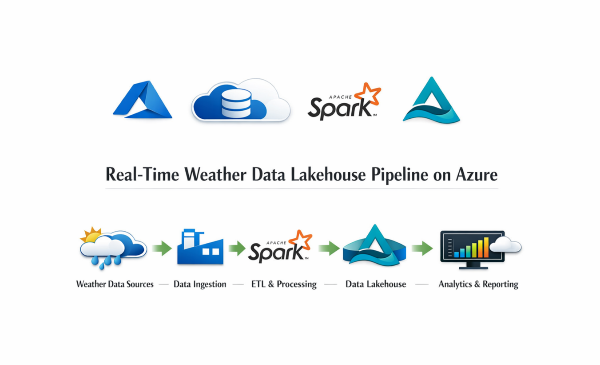

<br>

# Weather Data Lakehouse Pipeline on Azure

## Overview
This project demonstrates an end-to-end data engineering pipeline on Azure, simulating a real-world lakehouse architecture.
It integrates data ingestion, transformation, and analytics using Azure Data Factory and Azure Databricks, following the Medallion Architecture (Bronze, Silver, Gold).

## Architecture
Weather API → Azure Data Factory → Azure Databricks → Delta Lake (Bronze, Silver, Gold) → Power BI

## Tech Stack
- Azure Data Factory
- Azure Databricks
- Delta Lake
- Unity Catalog
- Power BI

## Execution Environment
This project is designed to run on Azure Databricks.

- Uses dbutils for file system operations and file management  
- Secrets are managed via Databricks Secret Scopes (integrated with Azure Key Vault)  
- Originally developed in Databricks notebooks and refactored into Python scripts for better version control and project organization

## Pipeline Design

### Bronze Layer
- Ingest raw weather data from API
- Store data in Delta format

### Silver Layer
- Perform basic data cleaning
- Handle missing values and simple transformations

### Gold Layer
- Prepare aggregated data for reporting
- Optimize data for Power BI usage

## Project Structure
```
weather-azure-databricks-lakehouse-pipeline/
├── aggregation/
│   └── weather_aggregated.py
│
├── ingestion/
│   └── api_call.py
│
├── transformation/
│   └── weather_processed.py
│
└── includes/
    ├── common_functions.py
    └── configuration.py
```

## Output
- Analytics-ready dataset
- Simple Power BI dashboard

## Key Learnings
- Built incremental data ingestion pipeline using Data Factory
- Practiced Medallion Architecture in Databricks
- Applied Delta Lake for scalable data processing
- Explored data governance with Unity Catalog
